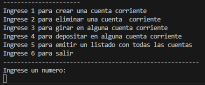
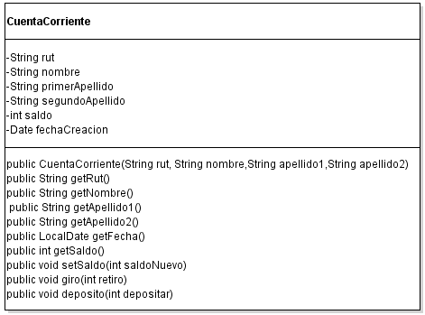

#CuentaCorriente 

#UML

## Descripción 📑

[PDF Del Problema](assets/pdf/laboratorio_2.pdf)

## ¿Qué he aprendido en este proyecto? 🙇🏻 

He diseñado e implementado una clase CuentaCorriente en Java que permite gestionar cuentas bancarias de manera eficiente. A continuación, detallo los aspectos clave aprendidos:

Diseño de Clases en Java:

Campos de Datos: He creado campos de datos privados para almacenar la información esencial de la cuenta, incluyendo el rut, nombre, primerApellido, segundoApellido, saldo, y fechaCreacion.
Encapsulamiento: Utilicé modificadores de acceso para proteger los datos de la clase, permitiendo el acceso y modificación a través de métodos get y set, garantizando así la integridad de la información.
Constructores:

Implementé un constructor que inicializa una nueva cuenta con los detalles del cliente y un saldo inicial. Esto asegura que cada objeto de la clase CuentaCorriente se cree con valores válidos desde el principio.
Métodos de Acceso y Modificación:

Desarrollé métodos get para acceder a los valores de todos los campos de datos y métodos set para modificar el saldo de la cuenta. Esto facilita la manipulación segura de los datos de la cuenta.
Métodos de Operación:

Implementé los métodos giro y depósito para realizar transacciones en la cuenta. Estos métodos permiten retirar y depositar dinero, y actualizan el saldo de la cuenta en consecuencia.
Uso de Fechas:

Utilicé la clase Date para almacenar la fecha de creación de la cuenta, lo que proporciona información adicional sobre el tiempo de vida de la cuenta.
Diagrama UML:

Creé un diagrama UML para representar visualmente la estructura y las relaciones de la clase CuentaCorriente, lo que facilita la comprensión del diseño de la clase.
Programa de Gestión de Cuentas:

Implementé un programa que permite crear y eliminar cuentas corrientes, realizar transacciones (giro y depósito), y emitir un listado de todos los clientes del banco. El programa incluye un menú interactivo para gestionar las operaciones de manera eficiente.
Interfaz de Usuario:

Diseñé un menú de usuario que permite interactuar con el sistema para gestionar las cuentas, lo que mejora la experiencia del usuario al realizar operaciones bancarias.
Impresión de Información:

Aseguré que las transacciones y el estado de la cuenta se impriman correctamente, incluyendo la información del cliente, el monto de la transacción, y el nuevo saldo de la cuenta.

## Tecnologías 🛠
<!-- Iconos sacados de: https://github.com/hendrasob/badges/blob/master/README.md y https://github.com/alexandresanlim/Badges4-README.md-Profile -->

## Autor ✒️
**Kamikazejar**

* <a href="https://www.linkedin.com/in/rodrigocarmonah/" target="_blank">LinkedIn</a>
* <a href="https://rodrigocarmonaherrera.com/" target="_blank">Portafolio Web</a>
* [Email](mailto:rcarmonah@outlook.com)

  
## Instalación 
Para compilar y ejecutar este proyecto Java, necesitarás un compilador Java. Si aún no tienes uno, puedes instalar el [JDK (Java Development Kit)](https://www.oracle.com/java/technologies/javase-downloads.html).
  
## Licencia 📄
MIT Public License v3.0
No puede usarse comencialmente.
